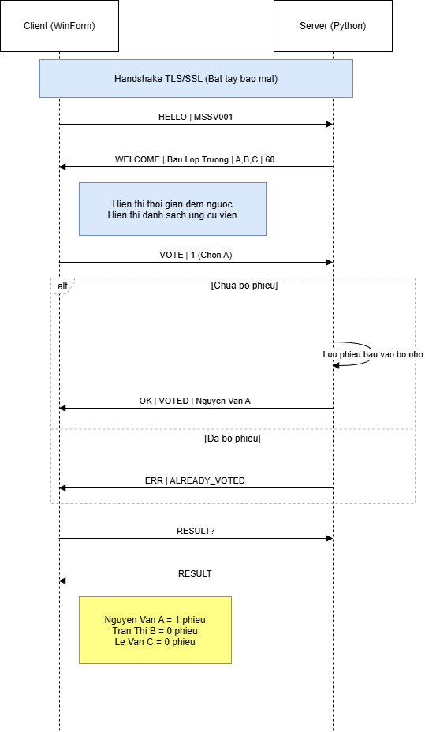

<div align="center">

  

  # 🗳️ Nhóm 1 - Hệ Thống Bỏ Phiếu An Toàn
  **Secure Voting System over TLS/SSL**

  > Môn học: Lập trình mạng
  > <br>Ứng dụng Client-Server cho phép bỏ phiếu điện tử bảo mật, đảm bảo tính toàn vẹn thông qua giao thức TLS/SSL.

  [](https://www.python.org/)
  [](https://dotnet.microsoft.com/)
  []()

</div>

---

## 📖 Giới thiệu

Hệ thống được thiết kế để tổ chức các cuộc bỏ phiếu trực tuyến với tính bảo mật cao trong môi trường mạng không tin cậy. Server và Client giao tiếp qua kênh mã hóa **SSL/TLS**, đảm bảo dữ liệu không bị nghe lén (Sniffing). Hệ thống đảm bảo tính toàn vẹn thông qua việc kiểm soát định danh (Client ID/MSSV), đảm bảo mỗi người chỉ được bỏ phiếu một lần duy nhất.

---

## ✨ Tính năng chính

### 🖥️ Server (Python)
* **Đa luồng (Multi-threading):** Xử lý nhiều client kết nối cùng lúc mà không bị chặn.
* **Bảo mật (SSL/TLS):** Sử dụng thư viện `ssl` để mã hóa toàn bộ gói tin giao tiếp.
* **Cấu hình linh hoạt:** Đọc chủ đề, thời gian và danh sách ứng cử viên từ file `vote.txt`.
* **Kiểm soát phiếu bầu:** Ngăn chặn một Client ID bỏ phiếu 2 lần (dùng `threading.Lock` để đồng bộ dữ liệu an toàn).

### 💻 Client (C# Windows Forms)
* **Giao diện trực quan:** Hiển thị danh sách lựa chọn, trạng thái kết nối.
* **Tương tác thời gian thực:** Đồng hồ đếm ngược giới hạn thời gian bỏ phiếu được đồng bộ từ Server.
* **Bảo mật:** Kết nối qua `SslStream` (Hỗ trợ cấu hình bỏ qua lỗi Self-signed Certificate cho môi trường Lab).
* **Xem kết quả:** Cho phép truy vấn và hiển thị kết quả tổng hợp từ Server.

---

## 🛠️ Yêu cầu hệ thống

1.  **Server:**
    * Python 3.8 trở lên.
    * Thư viện chuẩn (không cần cài thêm): `socket`, `ssl`, `threading`.
2.  **Client:**
    * Visual Studio 2019/2022 hoặc .NET SDK.
    * Windows OS (để chạy WinForms).
3.  **Công cụ hỗ trợ:**
    * OpenSSL (để tạo chứng chỉ SSL tự ký).

---

## 🚀 Hướng dẫn Cài đặt & Chạy

### Bước 1: Tạo chứng chỉ SSL (Quan trọng)
Server cần file chứng chỉ (`.crt`) và khóa riêng (`.key`) để thiết lập kênh bảo mật.

Chạy lệnh sau trong terminal (tại thư mục chứa `server.py`):
```bash
openssl req -new -newkey rsa:2048 -days 365 -nodes -x509 -keyout server.key -out server.crt
```
*Lưu ý: Khi được hỏi thông tin, bạn có thể điền tùy ý hoặc nhấn Enter để bỏ qua.*

### Bước 2: Cấu hình file `vote.txt`
Tạo file `vote.txt` cùng thư mục với `server.py`. Cấu trúc file bắt buộc như sau (lưu mã hóa **UTF-8**):

```text
Bầu chọn lớp trưởng lớp Lập trình mạng
time: 60
Nguyễn Văn A
Trần Thị B
Lê Văn C
```
* **Dòng 1:** Chủ đề bỏ phiếu.
* **Dòng 2:** `time: <số giây>` (Thời gian giới hạn).
* **Dòng 3 trở đi:** Các lựa chọn ứng cử viên.

### Bước 3: Khởi chạy Server
Mở terminal và chạy lệnh:
```bash
python server.py
```
*Server sẽ bắt đầu lắng nghe tại `0.0.0.0:8443`.*

### Bước 4: Khởi chạy Client
1.  Mở Project Client bằng Visual Studio.
2.  Build và nhấn **Start**.
3.  Nhập thông tin kết nối:
    * **Server IP:** `127.0.0.1` (nếu chạy cùng máy) hoặc IP LAN của máy server.
    * **Port:** `8443`.
    * **Client ID:** Nhập Mã sinh viên hoặc Tên định danh (VD: `MSSV001`).
4.  Nhấn **Kết nối** và bắt đầu bỏ phiếu.

---

## 📡 Giao thức Giao tiếp (Communication Protocol)

Hệ thống sử dụng giao thức dạng văn bản (Text-based) tùy biến qua Socket Secure.

| Hướng | Lệnh gửi đi | Mô tả |
| :--- | :--- | :--- |
| **Client -> Server** | `HELLO|<client_id>` | Gửi định danh để đăng nhập hệ thống. |
| **Server -> Client** | `WELCOME|<topic>|<opts>|<time>` | Phản hồi chủ đề, các lựa chọn và thời gian giới hạn. |
| **Client -> Server** | `VOTE|<index>` | Gửi lựa chọn (index bắt đầu từ 1). |
| **Server -> Client** | `OK|VOTED|<name>` | Xác nhận bỏ phiếu thành công. |
| **Server -> Client** | `ERR|ALREADY_VOTED` | Báo lỗi nếu ID này đã bỏ phiếu trước đó. |
| **Client -> Server** | `RESULT?` | Yêu cầu xem kết quả hiện tại. |
| **Server -> Client** | `RESULT|<k>:<v>;...` | Trả về chuỗi kết quả dạng key-value. |

---

## 📂 Cấu trúc dự án

```text
SecureVotingSystem/
├── Server/
│   ├── server.py        # Mã nguồn Server (Python)
│   ├── vote.txt         # File cấu hình nội dung bầu cử
│   ├── server.crt       # Chứng chỉ SSL (Tự tạo)
│   └── server.key       # Private Key SSL (Tự tạo)
└── Client/
    ├── Form1.cs         # Logic xử lý giao diện Client (C#)
    ├── Form1.Designer.cs
    ├── Program.cs
    └── ...
```

---

## 📊 Luồng hoạt động (Sequence Diagram)
<div align="center">
  
  <br>
  <em>Sơ đồ tuần tự hoạt động</em>
</div>

---

## 👥 Nhóm phát triển

Do đặc thù môn Lập trình mạng không tập trung vào Database, vai trò các thành viên được phân chia như sau:

| STT | Thành viên | Vai trò | Github |
| :--: | :--- | :--- | :--- |
| 1 | **Nguyễn Thu Hương** | **Team Leader / Server Dev**<br>(Phát triển Server Python, xử lý Đa luồng & SSL) | [@thuhun166](https://github.com/thuhun166) |
| 2 | **Lê Thiện Khôi** | **Frontend / Client Dev**<br>(Phát triển Client C#, xử lý Socket & Giao diện) | [@thienkhoi27](https://github.com/thienkhoi27) |
| 3 | **Nguyễn Tuấn Kiệt** | **Tester / Protocol Design**<br>(Thiết kế giao thức mạng, Test các trường hợp biên) | [@kitcoding17032005](https://github.com/kitcoding17032005) |
| 4 | **Hoàng Thanh Hải** | **Tester / Security QA**<br>(Kiểm thử bảo mật, Test kết nối SSL/TLS) | [@thanhhai1605](https://github.com/thanhhai1605) |
| 5 | **Hoàng Thị Kiều Diễm** | **Documentation / Config**<br>(Viết tài liệu, Cấu hình kịch bản vote.txt) | [@KieuDiem279](https://github.com/KieuDiem279) |

---

## ⚠️ Lưu ý

* **Self-signed Certificate:** Do sử dụng chứng chỉ tự ký, Client C# đã được cấu hình để `return true` trong `ServerCertificateValidationCallback`. Trong môi trường thực tế, cần sử dụng chứng chỉ từ CA uy tín.
* **Encoding:** File `vote.txt` **bắt buộc** lưu dưới dạng UTF-8 để hiển thị tiếng Việt chính xác.

<div align="center">
  <sub>Developed with ❤️ by Group 2 - Network Programming Class</sub>
</div>
